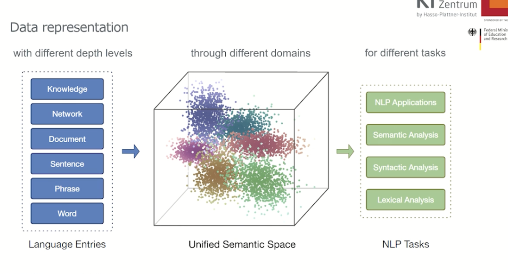
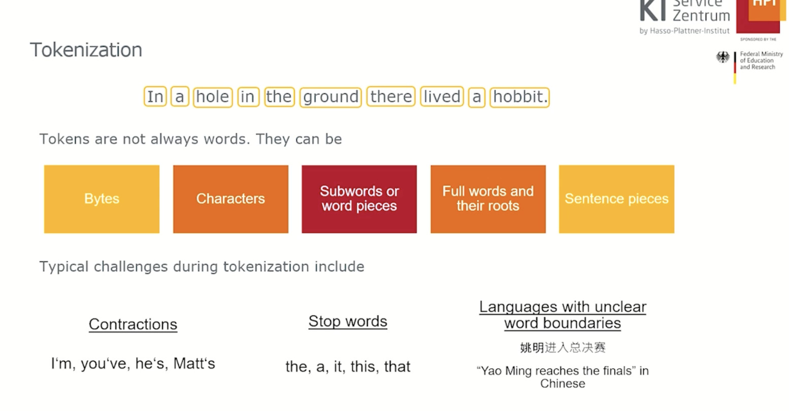
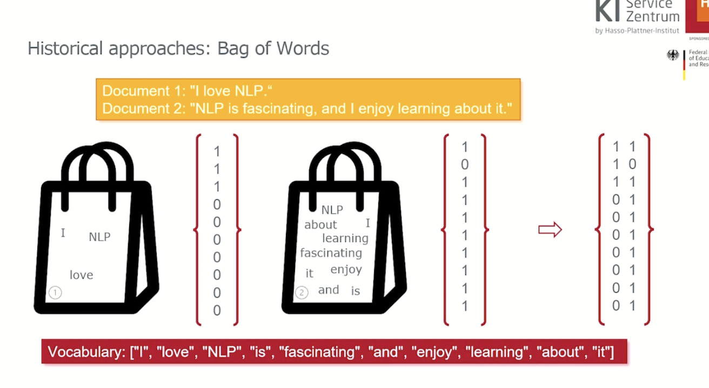
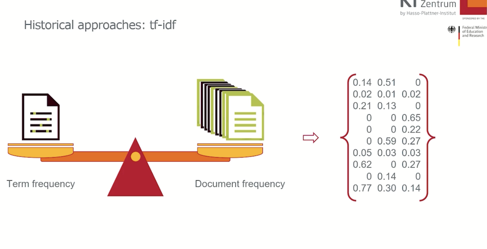

# AI/ML Text Processing Notes

## Introduction

This is the beginning of the notes.

## Goals

- Understand the challenges of converting unstructured text into numerical data for AI/ML
- Store vectors effectively

## Agenda

1. Turn text to numbers
2. Improving the representations
3. Storing Embeddings

---

## Part 1: Turning Text into Numbers

### Why Convert Text to Numbers?

Text-to-number conversion enables:

- Feeding data to ML/DL models
- Information retrieval
- Document summarization
- Language translation
- Content recommendation
- Sentiment analysis
- Question answering systems

### Data Representation Objectives

- Obtain a unified semantic space
- Create a single representation that works with all types of words
- Ensure practical usability of the representations

_Figure 1: Process of converting text to numerical representations_

---

### Challenges in Text Representation

1. **Dimensionality**: High-dimensional sparse vectors
2. **Semantics**: Capturing word meanings and relationships
3. **Context**: Handling polysemy (multiple meanings)
4. **Scalability**: Processing large text corpora

## Part 2: Tokenization and first models

### Tokenization

Tokens are not always words. There is not a fixed way to create tokens. It is an art to create tokens.

### Problems:

- contractions
- some words that are very repitive (like 'the', 'a')
- if pictogram languages like Chinese.

_Figure 2: Tokenization_

### Approaches

1.  **_Rule-Based Systems_** : say for a spam detection were based on rules such as repetition of words, lots of exclamation points or some patterns in spam messages. Then create a vector of those rules. Or count the frequency of appearance of those rules and create a vector. Problem:

- for new types of spam messages, need to keep on updating rules.
- Rules can also be biased

2.  **_Bag of Words_** : The first statistical model. Two documents each with single sentence. Create a vocabulary, don't keep repeated ones. Now make two bags: first with tokens of one sentence and second with tokens from another sentence to check. Now, create a vector of the words that are matching with the tokens in the vocabulary for both individually and combine these vectors to form a matrix. Columns represent documents, rows represent words. Word representation in various documents is our row.
    
    _Figure 3: Bag of Words_

### Advantages of Bag of Words:

- Simple, efficient, language agnostic, interpretability, useful for certain tasks

### Disadvantages

- lost information about the sequence(don't take into account how words are sorted, I love NLP, and I NLP love are the same for this )
- Fixed vocab size, equal importance to all, inefficient with large dataset, can't handle out of vocab words(when required a synonym?)

3. **_ tf-idf _** : Term frequency, inverse document frequency. Counting not only if the word is present or not but the frequency of the presence of the words.
   The problem? Some words might be repeated too often. Solution: take into consideration the frequency of occurrence of a word in that document and in all documents (see if a word appears in that particular document and then in other doucments or not) and compare term frequency to document frequency. Create vectors of them. Then assign weights to each term.

_Figure 3: tf-idf_

### Advantages of tf-idf: 
- paying attention to content relevance
- Language agnostic
- weighted representation

### Disadvantages of tf-idf: 

- sparse vectors (suppose in a million dimensional vector only 10 of the elements are 1 while all others are 0 (most are 0)? still computationally expensive)
- manual tuning required
- can't handle misspellings, ignores semantic meaning

---

## Key Concepts

### Text Vectorization Methods

| Method       | Description                          | Use Case                  |
| ------------ | ------------------------------------ | ------------------------- |
| Bag-of-Words | Count-based word representation      | Basic text classification |
| TF-IDF       | Frequency-inverse document frequency | Information retrieval     |
| Word2Vec     | Neural word embeddings               | Semantic analysis         |
| BERT         | Contextual embeddings                | Advanced NLP tasks        |
