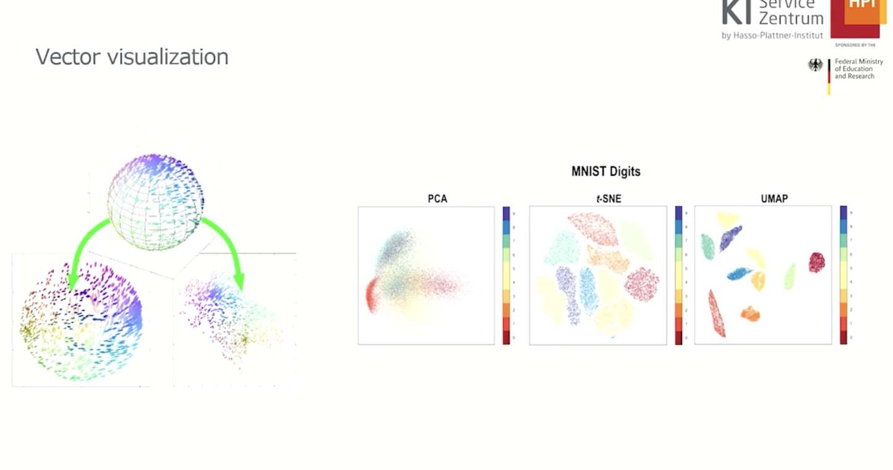

# AI/ML Text Processing Notes: Understanding Embeddings for Natural Language Processing

## Introduction

This is the beginning of the notes for a comprehensive 3-hour course on understanding embeddings in Natural Language Processing (NLP). Think of embeddings as a universal translator that converts human language into mathematical language that computers can understand and work with.

## Goals

- Understand the challenges of converting unstructured text into numerical data for AI/ML
- Master different text representation techniques from basic to advanced
- Learn how to store vectors effectively in modern databases
- Explore real-world applications and practical implementations

## Agenda

1. Turn text to numbers (The Foundation)
2. Improving the representations (The Evolution)
3. Storing Embeddings (The Infrastructure)

---

## Part 1: Turning Text into Numbers

### Why Convert Text to Numbers?

**Analogy**: Imagine you're a librarian who speaks only numbers, but all your books are written in different human languages. You need a system to convert every word, sentence, and paragraph into numbers so you can understand, organize, and retrieve information effectively.

Text-to-number conversion enables:

- **Feeding data to ML/DL models**: Machine learning algorithms only understand numbers
- **Information retrieval**: Finding relevant documents from millions of texts
- **Document summarization**: Automatically creating concise summaries
- **Language translation**: Converting text from one language to another
- **Content recommendation**: Suggesting relevant articles, products, or content
- **Sentiment analysis**: Determining if text expresses positive, negative, or neutral emotions
- **Question answering systems**: Building chatbots and virtual assistants

**Real-world Example**: When you search "best pizza in New York" on Google, the search engine converts your query and billions of web pages into numbers, compares them mathematically, and returns the most relevant results.

### Data Representation Objectives

The holy grail of text representation is to create a system that:

- **Obtains a unified semantic space**: All words live in the same mathematical universe
- **Creates a single representation**: One method that works with all types of words
- **Ensures practical usability**: Fast, efficient, and scalable for real applications

**Analogy**: Think of this like creating a universal coordinate system where every word has a specific address, and words with similar meanings live in the same neighborhood.


_Figure 1: Process of converting text to numerical representations_

---

### Challenges in Text Representation

Understanding these challenges is crucial for appreciating why we need sophisticated embedding techniques:

1. **Dimensionality**: High-dimensional sparse vectors

   - **Example**: A vocabulary of 100,000 words creates vectors with 100,000 dimensions, mostly filled with zeros
   - **Real-world impact**: Computationally expensive and memory-intensive

2. **Semantics**: Capturing word meanings and relationships

   - **Example**: "Car" and "automobile" should be close in our number space, even though they're different words
   - **Challenge**: How do we teach computers that "hot" and "cold" are opposites?

3. **Context**: Handling polysemy (multiple meanings)

   - **Example**: "Bank" in "river bank" vs. "savings bank" should have different numerical representations
   - **Complexity**: Same word, completely different meanings

4. **Scalability**: Processing large text corpora
   - **Real-world scale**: Processing billions of web pages, social media posts, or academic papers
   - **Challenge**: Maintaining quality while handling massive datasets

## Part 2: Tokenization and First Models

### Tokenization: The Art of Breaking Text Apart

**Definition**: Tokenization is the process of breaking text into smaller units called tokens.

**Important Insight**: Tokens are not always words! There's no fixed way to create tokens—it's both an art and a science.

**Analogy**: Think of tokenization like cutting a pizza. You could cut it into equal slices, cut it based on toppings, or cut it in completely irregular pieces. Each method serves different purposes.

### Tokenization Problems and Solutions:

1. **Contractions**:

   - Problem: "don't" → "do" + "n't" or "don't"?
   - Real-world impact: Affects sentiment analysis ("don't like" vs "do like")

2. **High-frequency words**:

   - Problem: Words like 'the', 'a', 'an' appear everywhere
   - Solution: Stop word removal or special handling

3. **Pictogram languages**:
   - Problem: Chinese characters don't have clear word boundaries
   - Solution: Character-level or subword tokenization

**Mathematical Representation of Tokenization**:

```
Text: "The quick brown fox"
Tokens: ["The", "quick", "brown", "fox"]
Token IDs: [1, 15, 847, 2094] (based on vocabulary mapping)
```


_Figure 2: Tokenization Process_

### Historical Approaches to Text Representation

#### 1. Rule-Based Systems

**Real-world Example**: Early spam detection systems

**How it works**:

- Create rules like: "If email contains >5 exclamation marks, it's spam"
- Count rule matches and create feature vectors

**Mathematical Representation**:

```
Email text: "URGENT!!! Win money now!!!"
Rules: [exclamation_count > 5, contains_urgency_words, all_caps_words]
Feature vector: [1, 1, 1] (all rules triggered)
```

**Problems**:

- Need constant rule updates for new spam types
- Rules can be biased and miss creative spam
- Not scalable for complex text understanding

#### 2. Bag of Words (BoW): The First Statistical Revolution

**Analogy**: Imagine you have a magic bag that contains all the words from a document, but the order is completely mixed up. You can count how many times each word appears, but you've lost all information about their original sequence.

**Step-by-step Example**:

**Document 1**: "I love natural language processing"
**Document 2**: "Natural language is fascinating"

**Step 1: Create Vocabulary**

```python
Vocabulary = ["I", "love", "natural", "language", "processing", "is", "fascinating"]
```

**Step 2: Create Vectors**

```python
Doc1_vector = [1, 1, 1, 1, 1, 0, 0]  # I=1, love=1, natural=1, etc.
Doc2_vector = [0, 0, 1, 1, 0, 1, 1]  # I=0, love=0, natural=1, etc.
```

**Step 3: Document-Term Matrix**

```
         I  love  natural  language  processing  is  fascinating
Doc1     1    1       1        1          1      0         0
Doc2     0    0       1        1          0      1         1
```


_Figure 3: Bag of Words Visualization_

**Mathematical Formula for BoW**:

```
BoW(d,w) = count(w in d)
```

Where:

- d = document
- w = word
- count(w in d) = number of times word w appears in document d

**Real-world Applications**:

- **Email classification**: Spam vs. not spam
- **Document categorization**: News articles into sports, politics, technology
- **Sentiment analysis**: Basic positive/negative classification

#### Advantages of Bag of Words:

- **Simple**: Easy to understand and implement
- **Efficient**: Fast computation for small datasets
- **Language agnostic**: Works with any language
- **Interpretable**: You can see exactly which words contribute to classification

#### Disadvantages of Bag of Words:

- **Lost sequence information**: "I love NLP" = "NLP love I"
- **Fixed vocabulary size**: Can't handle new words
- **Equal importance**: "the" gets same weight as "excellent"
- **Inefficient with large datasets**: Sparse, high-dimensional vectors
- **No semantic understanding**: "car" and "automobile" are completely different

#### 3. TF-IDF: Adding Intelligence to Word Counting

**Full Name**: Term Frequency - Inverse Document Frequency

**Core Idea**: Not all words are equally important. Common words (like "the") should have less weight, while rare but meaningful words should have more weight.

**Analogy**: Imagine you're a detective looking for clues in documents. Finding the word "murder" in a crime report is much more significant than finding "the" a hundred times. TF-IDF helps identify the "murder" words.

**Mathematical Breakdown**:

**Term Frequency (TF)**:

```
TF(t,d) = (Number of times term t appears in document d) / (Total number of terms in document d)
```

**Inverse Document Frequency (IDF)**:

```
IDF(t,D) = log(Total number of documents / Number of documents containing term t)
```

**Final TF-IDF Score**:

```
TF-IDF(t,d,D) = TF(t,d) × IDF(t,D)
```

**Step-by-step Example**:

**Corpus**:

- Doc1: "the cat sat on the mat"
- Doc2: "the dog ran in the park"
- Doc3: "cats and dogs are pets"

**Step 1: Calculate TF for "cat" in Doc1**

```
TF("cat", Doc1) = 1/6 = 0.167
```

**Step 2: Calculate IDF for "cat"**

```
IDF("cat") = log(3/1) = log(3) = 1.099
(appears in 1 out of 3 documents)
```

**Step 3: Calculate TF-IDF**

```
TF-IDF("cat", Doc1) = 0.167 × 1.099 = 0.183
```

**Comparison with "the"**:

```
TF("the", Doc1) = 2/6 = 0.333
IDF("the") = log(3/2) = 0.176  (appears in 2 out of 3 documents)
TF-IDF("the", Doc1) = 0.333 × 0.176 = 0.059
```

**Result**: "Cat" gets higher importance (0.183) than "the" (0.059)!


_Figure 4: TF-IDF Calculation Process_

**Real-world Applications**:

- **Search engines**: Ranking web pages for search queries
- **Document similarity**: Finding similar research papers
- **Keyword extraction**: Identifying important terms in documents
- **Information retrieval**: Library search systems

#### Advantages of TF-IDF:

- **Content relevance**: Emphasizes meaningful words
- **Language agnostic**: Works across different languages
- **Weighted representation**: Gives appropriate importance to different terms
- **Proven effectiveness**: Still used in many modern systems

#### Disadvantages of TF-IDF:

- **Sparse vectors**: Most elements are still zero
- **Manual tuning required**: Parameters need adjustment for different domains
- **Can't handle misspellings**: "recieve" vs "receive" are different
- **Ignores semantic meaning**: "happy" and "joyful" are unrelated
- **No context awareness**: "bank" always gets same weight regardless of context

---

## Key Concepts Summary Table

### Text Vectorization Methods Comparison

| Method           | Description             | Pros                           | Cons                       | Best Use Case                 |
| ---------------- | ----------------------- | ------------------------------ | -------------------------- | ----------------------------- |
| **Rule-Based**   | Hand-crafted features   | Interpretable, domain-specific | Not scalable, biased       | Simple classification tasks   |
| **Bag-of-Words** | Word frequency counting | Simple, efficient              | Loses word order, sparse   | Basic text classification     |
| **TF-IDF**       | Weighted word frequency | Emphasizes important terms     | Still sparse, no semantics | Information retrieval, search |
| **Word2Vec**     | Neural word embeddings  | Captures semantics, dense      | Static representations     | Semantic similarity tasks     |
| **BERT**         | Contextual embeddings   | Context-aware, state-of-art    | Computationally expensive  | Advanced NLP tasks            |

---

## Part 3: Improving the Representations - The Semantic Revolution

### The Limitations of Traditional Methods

**Problem Statement**: Previous algorithms (BoW, TF-IDF) treat words as isolated symbols without understanding their meanings or relationships.

**Real-world Challenge**:

- A search for "automobile" shouldn't miss documents about "cars"
- "Happy" and "joyful" should be recognized as similar
- "Hot coffee" and "cold coffee" should both be recognized as coffee-related

### Lexical Semantics: Understanding Word Relationships

**Key Concepts We Need to Capture**:

1. **Polysemy**: Words with multiple meanings

   - **Example**: "Bank" (financial institution vs. river bank)
   - **Challenge**: Same spelling, completely different concepts

2. **Synonyms**: Different words, same meaning

   - **Example**: "big", "large", "huge", "enormous"
   - **Goal**: These should have similar numerical representations

3. **Word Similarity**: Semantically related words

   - **Example**: "dog" and "cat" (both animals, both pets)
   - **Relationship**: Similar but not identical

4. **Word Relatedness**: Conceptually connected but not similar

   - **Example**: "cup" and "coffee" (related but different categories)
   - **Relationship**: Functional or associative connection

5. **Semantic Frames and Roles**: Context-dependent meanings

   - **Example**: "John bought a car from Mary"
   - **Roles**: John (buyer), Mary (seller), car (product)

6. **Connotations**: Emotional or cultural associations
   - **Example**: "cheap" vs "inexpensive" (both mean low cost, different feelings)

### The Concept of Embeddings: The Game Changer

**Definition**: Embeddings are dense vector representations of words that capture semantic relationships in a continuous space.

**Analogy**: Think of embeddings as a sophisticated GPS system for words. Instead of just giving each word a random address, embeddings place words in a meaningful neighborhood where similar words live close to each other, and the distance between words represents their semantic relationship.

**Key Properties of Embeddings**:

- **Dense**: Instead of mostly zeros, every dimension has meaningful values
- **Low-dimensional**: Typically 50-300 dimensions instead of vocabulary size
- **Semantic**: Mathematically similar words are semantically similar
- **Trained**: Learned from massive amounts of text data

### The Famous Analogy Example

**Mathematical Relationship**:

```
King - Man + Woman ≈ Queen
```

**Vector Arithmetic**:

```python
# In embedding space:
result = embedding("king") - embedding("man") + embedding("woman")
# result is closest to embedding("queen")
```

**What This Means**:

- The difference between "king" and "man" captures the concept of "royalty"
- Adding "woman" to this concept should give us "female royalty" = "queen"

**More Examples**:

```
Paris - France + Italy ≈ Rome
Walking - Walk + Swim ≈ Swimming
Bigger - Big + Small ≈ Smaller
```


_Figure 5: Word Embedding Analogies in 2D Space_

### Historical Semantics: Evolution of Word Meanings

**Fascinating Application**: Embeddings can track how word meanings change over time.

**Example**: The word "gay"

- 1900s embedding: close to "happy", "cheerful", "bright"
- 2000s embedding: close to "homosexual", "LGBTQ+", "pride"

**Method**: Train separate embeddings on text from different time periods and compare word positions.

### Important Caveat: Bias in Embeddings

**Critical Understanding**: Embeddings learn from human-generated text, which contains human biases.

**Examples of Learned Bias**:

```
Doctor - Man + Woman ≈ Nurse
CEO - Man + Woman ≈ Secretary
```

**Why This Happens**: If training data contains more instances of "male doctors" and "female nurses", the embedding will learn this pattern.

**Real-world Impact**:

- Biased hiring algorithms
- Unfair loan approval systems
- Discriminatory content recommendation

**Mitigation Strategies**:

- Debiasing techniques
- Diverse training data
- Bias detection and correction
- Ethical AI practices

---

## Interlude: Metrics and Visualization

### Vector Comparison Methods

Understanding how to measure similarity between embeddings is crucial for applications.


_Figure 6: Different Vector Similarity Metrics_

#### 1. Euclidean Distance

**Formula**:

```
d(A,B) = √[(A₁-B₁)² + (A₂-B₂)² + ... + (Aₙ-Bₙ)²]
```

**Interpretation**: Straight-line distance between two points
**Use Case**: When magnitude matters
**Example**: Measuring physical distances

#### 2. Cosine Similarity

**Formula**:

```
cos(θ) = (A·B) / (||A|| × ||B||)
```

Where:

- A·B = dot product of vectors A and B
- ||A|| = magnitude (length) of vector A

**Interpretation**: Measures angle between vectors, ignoring magnitude
**Range**: -1 (opposite) to +1 (identical)
**Use Case**: **Best for recommendation systems and semantic similarity**

**Why Cosine is Preferred**:

- Focuses on direction, not magnitude
- Handles different document lengths well
- More robust to scale differences

**Example Calculation**:

```python
# Two documents represented as vectors
doc1 = [3, 2, 0, 5]  # [love, hate, neutral, exciting]
doc2 = [1, 0, 0, 2]  # [love, hate, neutral, exciting]

# Dot product: 3×1 + 2×0 + 0×0 + 5×2 = 13
# Magnitude doc1: √(3² + 2² + 0² + 5²) = √38 ≈ 6.16
# Magnitude doc2: √(1² + 0² + 0² + 2²) = √5 ≈ 2.24

# Cosine similarity: 13 / (6.16 × 2.24) ≈ 0.94
```

#### 3. Manhattan Distance

**Formula**:

```
d(A,B) = |A₁-B₁| + |A₂-B₂| + ... + |Aₙ-Bₙ|
```

**Use Case**: When you need to consider each dimension independently

### Vector Visualization: Reducing Dimensions

**Challenge**: We live in 3D space, but embeddings often have 300+ dimensions. How do we visualize them?

**Solution**: Dimensionality reduction techniques

#### 1. Principal Component Analysis (PCA)

**How it works**: Finds the directions of maximum variance in the data

**Mathematical Intuition**:

```
1. Center the data (subtract mean)
2. Calculate covariance matrix
3. Find eigenvectors (principal components)
4. Project data onto top components
```

**Advantages**:

- Fast and deterministic
- Preserves global structure
- Mathematically well-understood

**Limitations**:

- Only captures linear relationships
- May not preserve local neighborhoods
- First few components might not capture semantic relationships

#### 2. t-SNE (t-distributed Stochastic Neighbor Embedding)

**Core Idea**: Preserve local neighborhoods when reducing dimensions

**How it works**:

1. Calculate probability distribution over pairs of high-dimensional points
2. Define similar probability distribution for low-dimensional points
3. Minimize divergence between the two distributions

**Advantages**:

- Excellent at preserving local structure
- Creates clear clusters
- Handles non-linear relationships

**Limitations**:

- Computationally expensive O(n²)
- Non-deterministic (different runs give different results)
- Doesn't preserve global structure well
- Difficult to interpret distances between clusters

#### 3. UMAP (Uniform Manifold Approximation and Projection)

**Why it's preferred**: Combines the best of PCA and t-SNE

**Advantages**:

- Faster than t-SNE
- Preserves both local and global structure
- More deterministic
- Better for very high-dimensional data

**Real-world Usage**: Current standard for embedding visualization

### Visualization Example: MNIST Dataset


_Figure 7: Comparison of Dimensionality Reduction Techniques on MNIST_

**Observation**: PCA struggles to separate digit classes, while t-SNE and UMAP create clear, separable clusters.

### Limitations of Visualization Techniques

#### 1. Information Loss

**Problem**: Reducing 300 dimensions to 2 inevitably loses information
**Analogy**: Like trying to understand a 3D elephant from its 2D shadow


_Figure 8: 3D to 2D Projection Loses Critical Information_

#### 2. Overcrowding and Clutter

**Problem**: Too many points in visualization become unreadable
**Solution**: Sampling or interactive visualization tools

#### 3. Interpretation Challenges

**Problem**: Even in 2D/3D, the axes don't have clear meaning
**Reality**: The dimensions don't correspond to interpretable features like "happiness" or "formality"

---

## Advanced Embeddings: The Deep Learning Revolution

### Word2Vec: The Breakthrough

**Innovation**: Instead of counting words, predict words based on context using neural networks.

**Key Insight**: "You shall know a word by the company it keeps" - words that appear in similar contexts should have similar embeddings.

#### Two Flavors of Word2Vec:

### 1. Continuous Bag-of-Words (CBOW)

**Task**: Predict the center word from surrounding context words

**Example**:

```
Sentence: "The quick brown fox jumps over the lazy dog"
Context window size: 2

Input: ["quick", "brown", "jumps", "over"]
Target: "fox"
```

**Architecture**:

```
Input Layer (Context Words) → Hidden Layer → Output Layer (Target Word)
```

**Mathematical Process**:

1. **Input**: One-hot vectors for context words
2. **Hidden layer**: Average of input word embeddings
3. **Output**: Softmax probability distribution over vocabulary

**Loss Function**:

```
L = -log P(target_word | context_words)
```


_Figure 9: CBOW Architecture and Process_

### 2. Skip-Gram

**Task**: Predict surrounding context words from center word (opposite of CBOW)

**Example**:

```
Input: "fox"
Targets: ["quick", "brown", "jumps", "over"]
```

**Why Skip-Gram is Often Preferred**:

- Better for infrequent words
- More training examples per word
- Generally produces better embeddings

**Mathematical Objective**:

```
Maximize Σ log P(context_word | center_word)
```


_Figure 10: Skip-Gram Architecture_

### Word2Vec Optimization Techniques

#### 1. Negative Sampling

**Problem**: Computing softmax over entire vocabulary (millions of words) is expensive

**Solution**: Instead of predicting the correct word from all words, just distinguish it from a few random "negative" words

**Mathematical Change**:

```
Instead of: P(word | context) over all vocabulary
Use: Binary classification for each word pair
```

**Example**:

```
Positive pair: ("fox", "quick") → should be similar
Negative pairs: ("fox", "elephant"), ("fox", "politics") → should be different
```

#### 2. Subsampling

**Problem**: Very frequent words (like "the", "a") don't provide much learning signal

**Solution**: Randomly skip very frequent words during training

**Benefits**:

- Faster training
- Better representations for less frequent words
- Reduced noise from stop words

### Word2Vec Training Process

**Step-by-step**:

1. **Tokenize** text corpus
2. **Create vocabulary** (typically 10K-100K most frequent words)
3. **Generate training pairs** using sliding window
4. **Initialize** random embedding matrices
5. **Train neural network** to predict target from context
6. **Extract embeddings** from trained weight matrices

**Hyperparameters**:

- **Vector size**: Usually 100-300 dimensions
- **Window size**: 5-10 words on each side
- **Learning rate**: 0.01-0.1
- **Training epochs**: 5-15

### Beyond Word2Vec: The Evolution

#### GloVe (Global Vectors for Word Representation)

**Key Innovation**: Combines global statistical information with local context

**How it works**:

1. Build global word co-occurrence matrix
2. Factor this matrix to get word vectors
3. Balance global and local context

**Mathematical Objective**:

```
Minimize: Σ f(Xᵢⱼ)(wᵢᵀwⱼ + bᵢ + bⱼ - log Xᵢⱼ)²
```

Where:

- Xᵢⱼ = number of times word j appears in context of word i
- wᵢ, wⱼ = word vectors
- bᵢ, bⱼ = bias terms
- f = weighting function

**Advantages over Word2Vec**:

- More efficient training
- Better performance on word similarity tasks
- Incorporates global corpus statistics

#### FastText

**Key Innovation**: Handles out-of-vocabulary words using subword information

**How it works**:

1. Break words into character n-grams
2. Represent each word as sum of its n-gram embeddings
3. Can handle misspellings and new words

**Example**:

```
Word: "running"
Character n-grams (n=3): ["<ru", "run", "unn", "nni", "nin", "ing", "ng>"]
Word embedding = sum of all n-gram embeddings
```

**Advantages**:

- Handles morphologically rich languages
- Robust to spelling errors
- Can represent unseen words

#### Doc2Vec

**Key Innovation**: Learn embeddings for entire documents, not just words

**Applications**:

- Document similarity
- Document classification
- Information retrieval


_Figure 11: Comparison of Different Embedding Methods_

### The Limitation: Static Embeddings

**Problem**: All previous methods create fixed embeddings for each word

**Issue**: Words like "bank" get the same representation regardless of context:

- "I went to the bank to deposit money" (financial institution)
- "We sat by the river bank" (river edge)

**Solution Needed**: Context-dependent, dynamic embeddings


_Figure 12: Static vs Contextual Embeddings Comparison_

### The Contextual Revolution: From RNNs to Transformers

**Evolution Path**:

```
CNNs → RNNs → LSTMs → GRUs → Attention Mechanisms → Transformers
```

#### Convolutional Neural Networks (CNNs)

**Contribution**: Local pattern recognition in text
**Limitation**: Fixed window size, no long-range dependencies

#### Recurrent Neural Networks (RNNs)

**Contribution**: Can handle sequences of any length
**Limitation**: Sequential processing, vanishing gradient problem

#### Long Short-Term Memory (LSTM)

**Contribution**: Solves vanishing gradient, remembers long-term dependencies
**Limitation**: Still sequential, computationally expensive

#### Gated Recurrent Units (GRUs)

**Contribution**: Simpler than LSTM, faster training
**Limitation**: Still sequential processing

#### Attention Mechanisms

**Breakthrough**: Can focus on relevant parts of input regardless of position
**Key Insight**: "Not all words in a sentence are equally important for understanding"

#### Transformers

**Revolution**: "Attention is All You Need"
**Key Innovation**: Parallel processing, multi-head attention

**Transformer Architecture Simplified**:

1. **Input Embeddings**: Convert words to vectors
2. **Positional Encoding**: Add position information
3. **Multi-Head Attention**: Focus on relevant words
4. **Feed-Forward Networks**: Process attended information
5. **Output**: Contextual embeddings

### Modern Contextual Embeddings

#### BERT (Bidirectional Encoder Representations from Transformers)

**Innovation**: Bidirectional context understanding

**Training Tasks**:

1. **Masked Language Modeling**: Predict hidden words

   ```
   Input: "The [MASK] is running in the park"
   Target: "dog"
   ```

2. **Next Sentence Prediction**: Determine if sentences follow each other
   ```
   Sentence A: "I love pizza"
   Sentence B: "It's my favorite food"
   Label: IsNext
   ```

**Contextual Power**:

```python
# BERT gives different embeddings for same word in different contexts
bert_embedding("bank", "I went to the bank for money") ≠
bert_embedding("bank", "We sat by the river bank")
```

### Sentence Embeddings and Sentence Transformers

**Challenge**: How do we get embeddings for entire sentences?

**Naive Approach**: Average all word embeddings

```python
sentence_embedding = mean([word_emb_1, word_emb_2, ..., word_emb_n])
```

**Problems with Averaging**:

- Loses word order information
- Doesn't capture sentence-level semantics
- Poor performance on semantic similarity tasks

**Solution**: Sentence-BERT (SBERT)

**SBERT Innovation**:

1. Fine-tune BERT on sentence pair tasks
2. Use siamese network architecture
3. Create sentence embeddings that preserve semantic similarity

**Applications**:

- Semantic search
- Clustering documents
- Paraphrase detection
- Question answering

### Getting Even Better Embeddings

#### Knowledge Graphs Integration

**Idea**: Combine text-based embeddings with structured knowledge

**Example**:

- Text: "Paris is beautiful"
- Knowledge: Paris → capital_of → France
- Combined embedding: Text semantics + Structured relationships

#### Multimodal Embeddings

**Innovation**: Embeddings that understand text, images, and audio together

**Examples**:

- **CLIP**: Connects images and text descriptions
- **DALL-E**: Generates images from text descriptions
- **Whisper**: Connects audio and text transcriptions

**Applications**:

- Image search with text queries
- Video understanding
- Cross-modal retrieval

---

## Part 4: Storing Embeddings - The Infrastructure

### The Need for Vector Databases

**Problem**: Traditional databases are designed for exact matches, not similarity searches

**Traditional Database Query**:

```sql
SELECT * FROM products WHERE name = "iPhone 13"
```

**Vector Database Query**:

```python
# Find products similar to this description
similar_products = vector_db.search(
    query_embedding=embed("smartphone with good camera"),
    top_k=10,
    similarity_threshold=0.8
)
```

### Vector Database Components

#### 1. Vector Indices

**Purpose**: Enable fast similarity search in high-dimensional spaces

**Challenge**: Brute force comparison is O(n×d) where n = number of vectors, d = dimensions

**Solutions**:

##### Approximate Nearest Neighbor (ANN) Algorithms:

**1. FAISS (Facebook AI Similarity Search)**

- **Method**: Various indexing strategies (IVF, HNSW, PQ)
- **Advantage**: Extremely fast, handles billions of vectors
- **Use case**: Large-scale similarity search

**2. Hierarchical Navigable Small World (HNSW)**

- **Method**: Graph-based search
- **Advantage**: Good recall-speed tradeoff
- **Use case**: Real-time applications

**3. Locality-Sensitive Hashing (LSH)**

- **Method**: Hash similar vectors to same buckets
- **Advantage**: Simple, fast for moderate dimensions
- **Use case**: Approximate similarity search

#### 2. Data Management Features

**Essential Capabilities**:

- **CRUD Operations**: Create, Read, Update, Delete vectors
- **Batch Operations**: Insert millions of vectors efficiently
- **Real-time Updates**: Add new vectors without reindexing
- **Scalability**: Handle growing datasets

#### 3. Metadata Storage and Filtering

**Example Use Case**:

```python
# Find similar products that are:
# 1. Semantically similar to query
# 2. In specific price range
# 3. From certain brand
results = vector_db.search(
    query_embedding=product_embedding,
    filters={
        "price": {"$gte": 100, "$lte": 500},
        "brand": "Apple",
        "category": "electronics"
    }
)
```

#### 4. Additional Features

**Backup and Recovery**:

- **Challenge**: Vector databases can contain billions of embeddings
- **Solution**: Incremental backups, distributed storage
- **Example**: Daily backups of new embeddings, weekly full backups

**Security and Access Control**:

- **Authentication**: User-based access control
- **Encryption**: At-rest and in-transit encryption
- **Audit Logs**: Track who accessed what embeddings when

**Integration Capabilities**:

- **REST APIs**: Easy integration with web applications
- **SDKs**: Python, JavaScript, Java client libraries
- **Streaming**: Real-time embedding updates
- **Batch Processing**: ETL pipelines for large datasets

### Popular Vector Database Solutions


_Figure 13: Landscape of Vector Database Solutions_

#### 1. Specialized Vector Databases

**Pinecone**:

- **Type**: Fully managed cloud service
- **Strengths**: Easy setup, automatic scaling, good performance
- **Use case**: Startups and companies wanting managed solutions
- **Pricing**: Pay-per-use model

**Weaviate**:

- **Type**: Open-source, GraphQL-based
- **Strengths**: Built-in ML models, semantic search out-of-the-box
- **Use case**: Companies wanting open-source flexibility
- **Special feature**: Can generate embeddings automatically

**Qdrant**:

- **Type**: Open-source, Rust-based
- **Strengths**: High performance, advanced filtering
- **Use case**: High-performance applications
- **Special feature**: Payload-based filtering

**Milvus**:

- **Type**: Open-source, cloud-native
- **Strengths**: Massive scale, multiple index types
- **Use case**: Large enterprises with big data
- **Special feature**: Supports multiple vector index algorithms

#### 2. Traditional Databases with Vector Extensions

**PostgreSQL with pgvector**:

- **Advantage**: Use existing PostgreSQL infrastructure
- **Limitation**: Not optimized for large-scale vector operations
- **Use case**: Small to medium applications with existing PostgreSQL setup

**Elasticsearch with Dense Vector**:

- **Advantage**: Combine text search with vector search
- **Use case**: Applications needing both traditional and semantic search

**Redis with RedisSearch**:

- **Advantage**: In-memory speed
- **Limitation**: Memory constraints
- **Use case**: Real-time applications with moderate data sizes

#### 3. Cloud Provider Solutions

**Amazon OpenSearch Service**:

- **Integration**: Works with AWS ecosystem
- **Use case**: AWS-centric applications

**Azure Cognitive Search**:

- **Integration**: Microsoft cloud services
- **Use case**: Microsoft-centric environments

**Google Vertex AI Matching Engine**:

- **Integration**: Google Cloud Platform
- **Use case**: Google Cloud applications

### Vector Database Architecture Patterns

#### 1. Centralized Architecture

```
Application → API Gateway → Vector Database → Storage
```

**Pros**: Simple, consistent
**Cons**: Single point of failure, scaling limitations

#### 2. Distributed Architecture

```
Application → Load Balancer → Multiple Vector DB Nodes → Distributed Storage
```

**Pros**: Scalable, fault-tolerant
**Cons**: Complex, eventual consistency challenges

#### 3. Hybrid Architecture

```
Application → Cache Layer → Vector DB → Traditional DB
```

**Pros**: Best of both worlds
**Cons**: Increased complexity

### Real-World Implementation Considerations

#### Performance Optimization

**Indexing Strategy**:

```python
# Example configuration for different use cases

# High-speed, lower accuracy
index_config = {
    "type": "IVF",
    "nlist": 1024,  # Number of clusters
    "nprobe": 10    # Number of clusters to search
}

# High accuracy, slower speed
index_config = {
    "type": "HNSW",
    "M": 16,        # Number of bi-directional links
    "efConstruction": 200,  # Size of candidate set
    "efSearch": 100  # Size of search candidate set
}
```

**Memory vs. Speed Tradeoffs**:

- **In-memory**: Fastest, but expensive for large datasets
- **SSD storage**: Good balance of speed and cost
- **Hybrid**: Hot data in memory, cold data on disk

#### Cost Optimization

**Dimensionality Reduction Impact**:

```python
# Storage cost comparison
embedding_300d = 300 * 4 bytes = 1.2 KB per vector
embedding_128d = 128 * 4 bytes = 512 bytes per vector

# For 1 million vectors:
300d storage: 1.2 GB
128d storage: 512 MB
Savings: ~58% storage reduction
```

**Quantization Techniques**:

- **Float32 → Float16**: 50% storage reduction, minimal accuracy loss
- **Float32 → Int8**: 75% storage reduction, some accuracy loss
- **Product Quantization**: Even higher compression with structured approach

### Practical Vector Database Usage

#### 1. Semantic Search Implementation

**Example: E-commerce Product Search**

```python
class ProductSearchEngine:
    def __init__(self, vector_db, embedding_model):
        self.vector_db = vector_db
        self.embedding_model = embedding_model

    def index_products(self, products):
        """Index all products with their embeddings"""
        for product in products:
            # Create embedding from product description
            description = f"{product.name} {product.description} {product.category}"
            embedding = self.embedding_model.encode(description)

            # Store in vector database with metadata
            self.vector_db.upsert(
                id=product.id,
                vector=embedding,
                metadata={
                    "name": product.name,
                    "price": product.price,
                    "category": product.category,
                    "rating": product.rating
                }
            )

    def search(self, query, filters=None, top_k=10):
        """Search for products using natural language"""
        query_embedding = self.embedding_model.encode(query)

        results = self.vector_db.query(
            vector=query_embedding,
            top_k=top_k,
            filter=filters,
            include_metadata=True
        )

        return results

# Usage example
search_engine = ProductSearchEngine(vector_db, sentence_transformer)

# Natural language search
results = search_engine.search(
    query="comfortable running shoes for marathon",
    filters={"category": "footwear", "price": {"$lte": 200}},
    top_k=5
)
```

#### 2. Document Similarity and Clustering

**Example: Research Paper Recommendation**

```python
class PaperRecommendationSystem:
    def __init__(self, vector_db):
        self.vector_db = vector_db

    def find_similar_papers(self, paper_id, threshold=0.7):
        """Find papers similar to given paper"""
        # Get the paper's embedding
        paper_vector = self.vector_db.fetch(paper_id)

        # Find similar papers
        similar_papers = self.vector_db.query(
            vector=paper_vector,
            top_k=20,
            include_metadata=True
        )

        # Filter by similarity threshold
        recommendations = [
            paper for paper in similar_papers
            if paper.score >= threshold and paper.id != paper_id
        ]

        return recommendations

    def cluster_papers_by_topic(self, paper_ids, num_clusters=5):
        """Group papers into topic clusters"""
        vectors = [self.vector_db.fetch(pid) for pid in paper_ids]

        # Use clustering algorithm
        from sklearn.cluster import KMeans
        kmeans = KMeans(n_clusters=num_clusters)
        clusters = kmeans.fit_predict(vectors)

        # Group papers by cluster
        clustered_papers = {}
        for i, cluster_id in enumerate(clusters):
            if cluster_id not in clustered_papers:
                clustered_papers[cluster_id] = []
            clustered_papers[cluster_id].append(paper_ids[i])

        return clustered_papers
```

#### 3. Multimodal Search

**Example: Image-Text Search System**

```python
class MultimodalSearchEngine:
    def __init__(self, vector_db, clip_model):
        self.vector_db = vector_db
        self.clip_model = clip_model  # CLIP model for image-text embeddings

    def index_images_with_captions(self, image_data):
        """Index images with their captions"""
        for item in image_data:
            # Create multimodal embedding
            image_embedding = self.clip_model.encode_image(item.image_path)
            text_embedding = self.clip_model.encode_text(item.caption)

            # Combined embedding (various strategies possible)
            combined_embedding = (image_embedding + text_embedding) / 2

            self.vector_db.upsert(
                id=item.id,
                vector=combined_embedding,
                metadata={
                    "image_path": item.image_path,
                    "caption": item.caption,
                    "tags": item.tags
                }
            )

    def search_images_by_text(self, text_query, top_k=10):
        """Find images using text description"""
        text_embedding = self.clip_model.encode_text(text_query)

        results = self.vector_db.query(
            vector=text_embedding,
            top_k=top_k,
            include_metadata=True
        )

        return results

    def search_by_image(self, image_path, top_k=10):
        """Find similar images"""
        image_embedding = self.clip_model.encode_image(image_path)

        results = self.vector_db.query(
            vector=image_embedding,
            top_k=top_k,
            include_metadata=True
        )

        return results
```

### Vector Database Performance Benchmarking

#### Key Metrics to Monitor

**1. Query Latency**:

```python
# Typical latency expectations
Fast: < 10ms (in-memory, small dataset)
Good: 10-100ms (SSD storage, optimized indices)
Acceptable: 100-500ms (large datasets, complex queries)
Slow: > 500ms (needs optimization)
```

**2. Throughput**:

```python
# Queries per second expectations
High: > 1000 QPS
Medium: 100-1000 QPS
Low: < 100 QPS
```

**3. Recall Accuracy**:

```python
# Percentage of relevant results returned
Excellent: > 95% recall
Good: 90-95% recall
Acceptable: 80-90% recall
Poor: < 80% recall
```

**4. Index Build Time**:

```python
# Time to build index for different dataset sizes
1M vectors: Minutes to hours
10M vectors: Hours
100M+ vectors: Multiple hours to days
```

#### Optimization Strategies

**1. Index Selection**:

```python
# Choose index based on use case
Real-time applications: HNSW (fast query, slower build)
Batch processing: IVF (fast build, configurable accuracy)
Memory constrained: PQ (compressed, lower memory usage)
Hybrid: IVF + PQ (balanced approach)
```

**2. Hardware Optimization**:

- **CPU**: More cores help with parallel processing
- **Memory**: Keep frequently accessed vectors in RAM
- **Storage**: NVMe SSDs for faster disk access
- **GPU**: Accelerate similarity computations

**3. Query Optimization**:

```python
# Batch queries when possible
results = vector_db.query_batch([
    query_vector_1,
    query_vector_2,
    query_vector_3
])

# Use appropriate top_k values
# Don't request more results than needed
results = vector_db.query(vector=query, top_k=10)  # Not top_k=1000
```

### Common Vector Database Challenges and Solutions

#### 1. Cold Start Problem

**Challenge**: New system with no embeddings
**Solutions**:

- Pre-populate with general embeddings
- Use transfer learning from similar domains
- Implement progressive learning as data arrives

#### 2. Embedding Drift

**Challenge**: Model updates change embedding space
**Solutions**:

- Version control for embeddings
- Gradual migration strategies
- A/B testing for embedding updates

#### 3. Scale Challenges

**Challenge**: Growing from thousands to millions of vectors
**Solutions**:

- Horizontal partitioning (sharding)
- Hierarchical indexing
- Distributed vector databases

#### 4. Data Quality Issues

**Challenge**: Poor quality embeddings hurt performance
**Solutions**:

- Embedding quality monitoring
- Outlier detection and removal
- Regular re-embedding with updated models

---

## Comprehensive Summary and Future Directions


_Figure 14: Complete Journey from Text to Embeddings to Applications_

### The Evolution Timeline

**Historical Progression**:

```
1950s-1980s: Rule-based systems
1990s-2000s: Statistical methods (BoW, TF-IDF)
2010s: Neural embeddings (Word2Vec, GloVe)
2017-2020s: Transformer revolution (BERT, GPT)
2020s+: Multimodal and specialized embeddings
```

### Key Takeaways by Learning Objective

#### 1. Text-to-Numbers Conversion Mastery

**What We've Learned**:

- **Simple methods** (BoW, TF-IDF): Good for basic tasks, interpretable
- **Neural methods** (Word2Vec, BERT): Capture semantics, better performance
- **Trade-offs**: Complexity vs. performance vs. interpretability

**Practical Decision Framework**:

```python
def choose_embedding_method(task, data_size, resources):
    if task == "simple_classification" and data_size < 10000:
        return "TF-IDF"
    elif task == "semantic_search" and resources == "limited":
        return "Word2Vec"
    elif task == "advanced_nlp" and resources == "abundant":
        return "BERT"
    else:
        return "Sentence-BERT"  # Good general choice
```

#### 2. Representation Quality Understanding

**Quality Factors**:

- **Semantic similarity**: Similar words have similar embeddings
- **Analogical reasoning**: Vector arithmetic captures relationships
- **Contextual awareness**: Same word, different contexts, different embeddings
- **Robustness**: Handles typos, variations, domain changes

**Evaluation Methods**:

```python
# Intrinsic evaluation
similarity_score = cosine_similarity(embedding("king"), embedding("queen"))
analogy_accuracy = test_analogies(embedding_model)

# Extrinsic evaluation
classification_accuracy = evaluate_on_downstream_task(embeddings)
search_relevance = evaluate_search_quality(search_results)
```

#### 3. Storage and Retrieval Expertise

**Infrastructure Considerations**:

- **Scale**: Million vs. billion embeddings require different approaches
- **Speed**: Real-time vs. batch processing needs
- **Cost**: Storage, compute, and maintenance costs
- **Reliability**: Backup, recovery, and consistency requirements

### Real-World Application Patterns

#### 1. Search and Information Retrieval

**Components**:

```
User Query → Embedding → Vector Search → Ranking → Results
```

**Success Stories**:

- **Google Search**: Uses embeddings for understanding query intent
- **Amazon Product Search**: Semantic matching beyond keyword matching
- **Spotify Recommendations**: Music similarity based on audio and text features

#### 2. Content Recommendation Systems

**Architecture**:

```
User Profile → User Embedding → Similarity Search → Content Recommendations
```

**Examples**:

- **Netflix**: Movie recommendations using plot embeddings
- **LinkedIn**: Job recommendations using skill and experience embeddings
- **Medium**: Article recommendations using content embeddings

#### 3. Customer Support Automation

**Workflow**:

```
Customer Question → Embedding → Similar Question Search → Automated Response
```

**Implementation**:

- **FAQ Matching**: Find similar previously answered questions
- **Ticket Routing**: Route tickets to appropriate support agents
- **Chatbot Responses**: Generate contextually appropriate responses

#### 4. Content Moderation

**Process**:

```
User Content → Embedding → Policy Violation Detection → Action
```

**Applications**:

- **Hate Speech Detection**: Identify harmful content variations
- **Spam Detection**: Catch spam variations that bypass keyword filters
- **Misinformation Detection**: Identify similar false claims

### Advanced Topics and Future Directions

#### 1. Specialized Embeddings

**Domain-Specific Models**:

- **Scientific Text**: SciBERT, BioBERT for research papers
- **Legal Text**: LegalBERT for contracts and legal documents
- **Code**: CodeBERT for programming languages
- **Medical**: ClinicalBERT for medical records

**Multilingual Embeddings**:

- **Cross-lingual Models**: XLM-R, mBERT for multiple languages
- **Language-Specific**: Optimized models for specific languages
- **Code-switching**: Handling mixed-language text

#### 2. Multimodal Future

**Current Trends**:

- **Vision-Language**: CLIP, DALL-E, Flamingo
- **Audio-Language**: Whisper, SpeechT5
- **Video Understanding**: VideoBERT, Video-ChatGPT

**Emerging Applications**:

- **Visual Search**: Search images using text descriptions
- **Audio Content Search**: Find podcast segments by topic
- **Video Understanding**: Automated video tagging and search

#### 3. Efficiency and Sustainability

**Model Compression**:

- **Distillation**: Smaller models that mimic larger ones
- **Quantization**: Reduced precision for faster inference
- **Pruning**: Remove unnecessary model parameters

**Green AI Initiatives**:

- **Carbon Footprint**: Measuring and reducing training emissions
- **Efficient Architectures**: Designs that need less computation
- **Hardware Optimization**: Specialized chips for embeddings

#### 4. Ethical Considerations

**Bias Mitigation**:

- **Debiasing Techniques**: Mathematical methods to reduce bias
- **Diverse Training Data**: More representative datasets
- **Bias Detection**: Tools to identify biased embeddings

**Privacy Protection**:

- **Differential Privacy**: Adding noise to protect individual privacy
- **Federated Learning**: Training without centralizing data
- **Secure Computation**: Computing on encrypted embeddings

### Practical Next Steps for Learners

#### 1. Hands-On Practice

**Beginner Projects**:

```python
# 1. Build a simple document similarity system
# 2. Create a basic recommendation engine
# 3. Implement semantic search for a small dataset
```

**Intermediate Projects**:

```python
# 1. Fine-tune embeddings for specific domain
# 2. Build a multimodal search system
# 3. Implement a vector database from scratch
```

**Advanced Projects**:

```python
# 1. Create domain-specific embedding models
# 2. Build distributed vector search system
# 3. Implement bias detection and mitigation
```

#### 2. Tool Proficiency

**Essential Tools to Master**:

- **Embedding Libraries**: sentence-transformers, transformers, gensim
- **Vector Databases**: Pinecone, Weaviate, Qdrant
- **ML Frameworks**: PyTorch, TensorFlow, Hugging Face
- **Visualization**: t-SNE, UMAP, matplotlib, plotly

#### 3. Continuous Learning

**Stay Updated With**:

- **Research Papers**: ArXiv, conferences (ACL, EMNLP, ICLR)
- **Industry Blogs**: OpenAI, Google AI, Facebook Research
- **Community**: Reddit r/MachineLearning, Twitter AI community
- **Courses**: Advanced NLP, Deep Learning specializations

### Final Thoughts: The Embedding Revolution

**Why Embeddings Matter**:
Embeddings represent one of the most significant breakthroughs in making AI understand human language. They bridge the gap between human communication and mathematical computation, enabling machines to process meaning rather than just symbols.

**The Impact**:

- **Search**: From keyword matching to semantic understanding
- **Translation**: From rule-based to meaning-based translation
- **Recommendation**: From simple filtering to deep preference understanding
- **Content Creation**: From templates to creative AI assistance

**Looking Forward**:
The field continues to evolve rapidly. Today's state-of-the-art will be tomorrow's baseline. The key is understanding the fundamental principles while staying adaptable to new developments.

**Success Metrics for This Course**:
By the end of this material, you should be able to:

- ✅ Explain why we need embeddings and their advantages over traditional methods
- ✅ Choose appropriate embedding techniques for different tasks
- ✅ Implement basic to advanced embedding-based applications
- ✅ Design and deploy vector database solutions
- ✅ Evaluate and improve embedding quality
- ✅ Understand the ethical implications and mitigation strategies

---

## Additional Resources for Deep Diving


_Figure 15: Recommended Resources for Continued Learning_

### Essential Books

- **"Speech and Language Processing"** by Dan Jurafsky & James H. Martin
- **"Natural Language Processing with Python"** by Steven Bird
- **"Hands-On Machine Learning"** by Aurélien Géron
- **"Deep Learning"** by Ian Goodfellow, Yoshua Bengio, and Aaron Courville

### Online Courses

- **CS224N: Natural Language Processing with Deep Learning** (Stanford)
- **Hugging Face NLP Course** (Free, comprehensive)
- **Fast.ai NLP Course** (Practical approach)
- **DeepLearning.ai NLP Specialization** (Coursera)

### Research Venues

- **Conferences**: ACL, EMNLP, NAACL, ICLR, NeurIPS
- **Journals**: TACL, Computational Linguistics
- **Preprint**: ArXiv cs.CL section

### Practical Resources

- **Hugging Face Model Hub**: Pre-trained models
- **Papers with Code**: Implementation references
- **Google Colab**: Free GPU/TPU for experimentation
- **Kaggle**: Datasets and competitions

### Industry Blogs and Updates

- **OpenAI Blog**: Latest in language models
- **Google AI Blog**: Research and applications
- **Facebook AI Research**: Cutting-edge developments
- **Anthropic**: AI safety and capabilities research

---

**Course Completion**: Congratulations! You've journeyed from basic text counting to sophisticated semantic understanding. The world of embeddings is vast and constantly evolving, but you now have the foundation to navigate it successfully. Remember: the best way to master embeddings is through hands-on practice with real datasets and problems. Start building, keep learning, and contribute to this exciting field!
